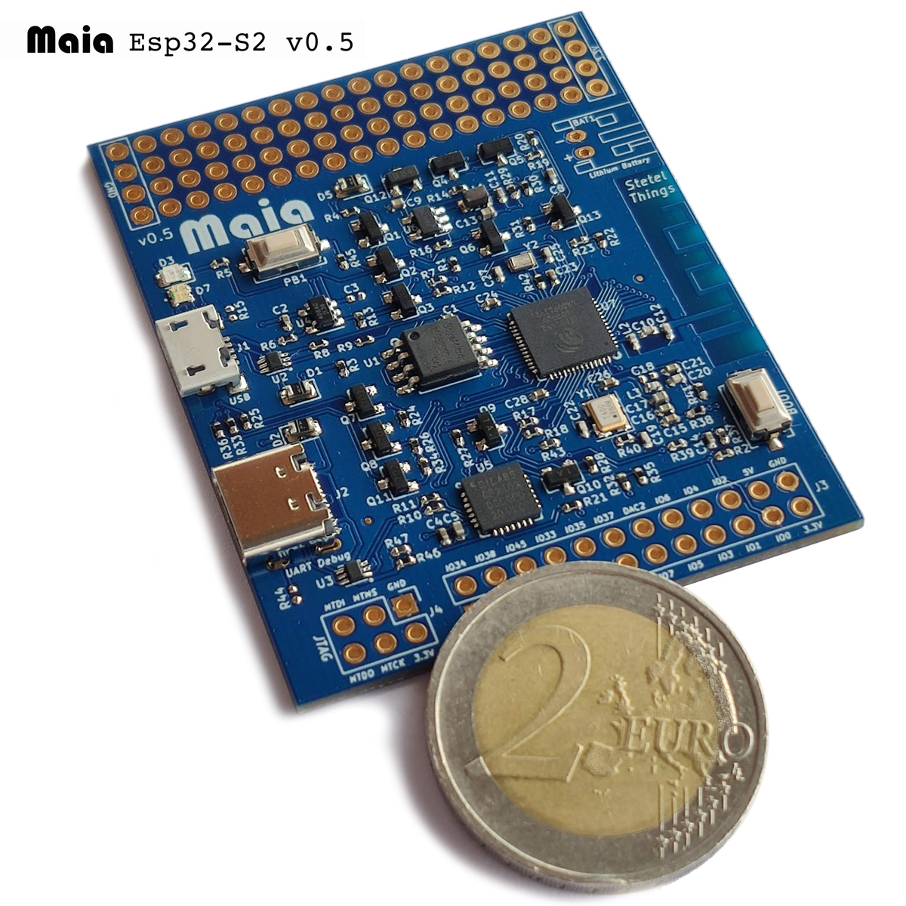
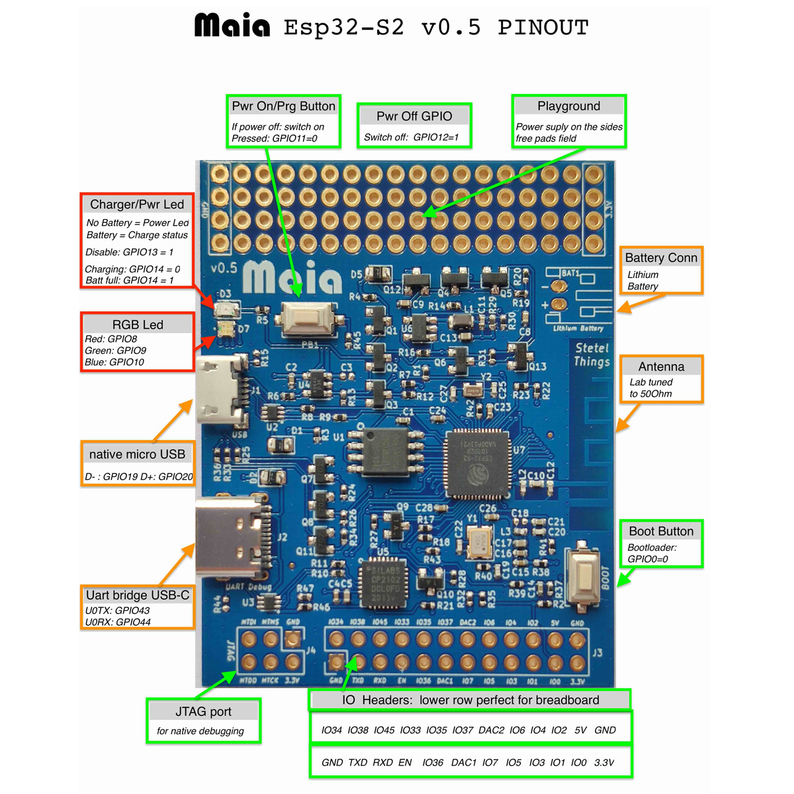

# Maia ESP32-S2 the Devboard for Makers

Developer board for the Esp32-S2 chip from Espressif. Provides both USB interfaces: native and Uart bridge. Allows to control power via simple GPIO pins. Battery can be attached and charged from both USB ports. IO pins can be used on a bread-board. JTAG port for natvie debugging. "Playground" zone to attach sensors. Enclosure and battery kit available. RGB led can be used to provide status and can be driven via PWM.

- ESP32-S2 Espressif microcontroller: single core LX7 running at 240 MHz along with a RISC-V ultra lo power CPU. 320KB Ram, 4MB flash
- With 2 USB ports:  UART bridge to use all known ESP32 tools and native USB OTG port [^1]
- User button: programmable. Also powers up the board when switched off.
- Lithium battery charger
- Charging status can be read via GPIO. 
- Charging Led can be switched off via GPIO.
- The Devboard can switch off itself via a simple GPIO pin.

[^1]: You can flash also via [DFU Web Flasher](https://dfu.stetelthings.com)

## Pinout

---

## **Versatility** 

The Maia board can be used in many different ways:

### USB attached devboard
In this case you just plug the devboard via USB with your computer. Make sure you use a good quality USB cable (we lost plenty of time troubleshooting to discover that the cable was faulty). 
If you don't use a battery then the Red Led becomes a normal Power led. 
If you want to flash the chip using the well known ESP32 tools then you have to connect to the **USB-C** connector which uses the USB-UART bridge. This is also currently recommended for the debugging console (the debug logging text ). Resting and bootmode are automatically handled by the tools and the bridge chip.

Flashing over the new native USB port is possible by plugging the board holding down the "boot" button. This sets the chip into the rom bootloader mode. 
Now you can either attempt to flash via the exposed CDC serial interface (lookup for the serial port on your OS) or flash via DFU using a command line tool like `dfu-util` or flash via web using our [ESP32-S2 Web flasher](https://dfu.stetelthings.com)

### Using the Devboard on a breadboard
The lower row of the io header pads contains all needed signals to run your board inserted in a breadboard. 
You get the GPIO0, EN, 3.3V, RX, TX and GND signals for programming on a breadboard.
Solder header pins with the long side on the backside and you're done.

### Attaching sensor or peripherals
You can solder header pins withe the long side on the front to attach external sensors with simple jump-wires.

### Self powered with a battery
You can either solder directly a lithium battery or a connector.
The battery can easly attached to the backside.
Some important points to remember When using a battery:

- If you switch off the board via GPIO12 and then connect the board to via USB you **must** switch the board on with the Power on button.
- When flashing via DFU you have to reset the board connecting EN shortly to GND. There is a placeholder for Reset button on the backside that can be used for this purpose.

### Complete IoT device with Enclosure
We have a plastic enclosure kit available that can be used to build a complete and standalone IoT product. 

- The power on button is available on the front side of the enclosure. 
- The backside hosts a lithium battery.
- User can power on via button. 
- Device can completely power off itself programmatically via simple GPIO pin.
- Battery can be recharged via exposed micro-USB port.
- Update is possible either via OTA or using DFU at the micro-USB port.
- RGB and charging leds are visible through specific light-guide in the enclosure.

### Where to buy one

You can buy a Maia board from:
- [Amazon.it](https://amzn.to/2Nnwgw7)
- [Tindie](https://bit.ly/MaiaTindie)    